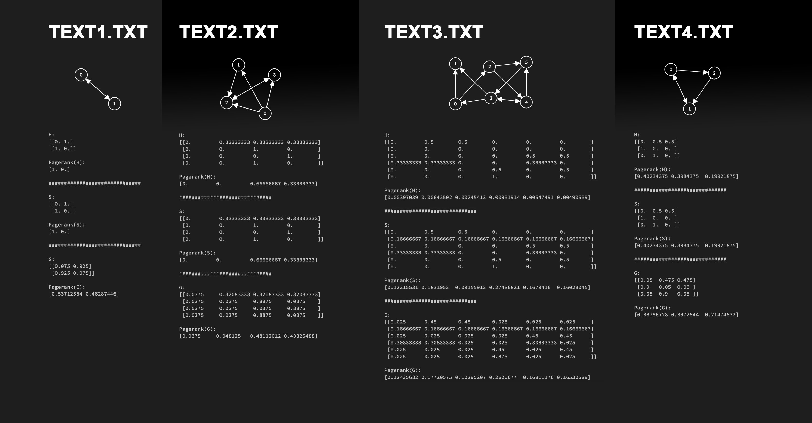

# Tutorial 4 - Pagerank

The results in results/output.jpg image were made over 16 iterations and Google Matrix with a value of damping vector equal to 0.85, which is approximately equil to the same, that is used in Google Search Engine \[in DDW-lectures\].

Higher number of iterations let to:
1. For H matrix: Nullify PR for IN pages, repeteadly. For infinity, only nodes in cycles will not have PR equal to zero.
2. For S matrix: If there is a page accessible in circle that does not provide any outlink, then every IN tendril has some pagerank (this sounds a bit weird, why would unaccessiable pages be in advantage, because of a page not providing outlinks).
3. For G matrix: It prefers more and more nodes, that have inlinks and outlinks at the same time. This is shown in text2.txt, where the node 3 has higher pagerank than node 1, they have same number of inlinks though. It is known fact, that Google's Pagerank likes cycles much more than a single inlink. I know that for Google, triangle cycle was more interesting then a cycle between two nodes only.

Higher value of damping factor led to the equievalent of random walk (random choose). If a damping factor is 0, then every node has the same pagerank.

## Results

